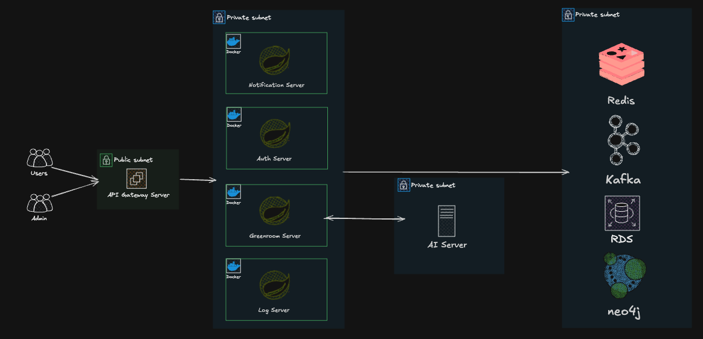
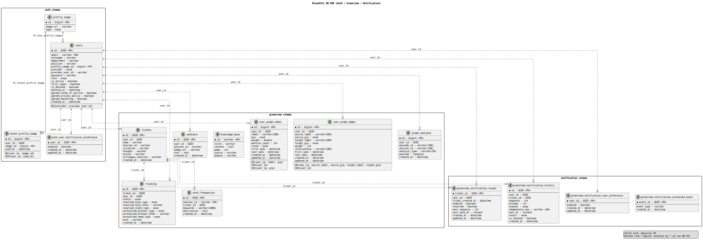
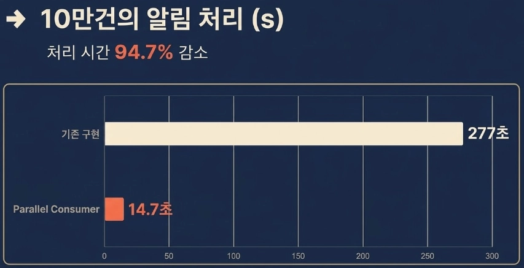
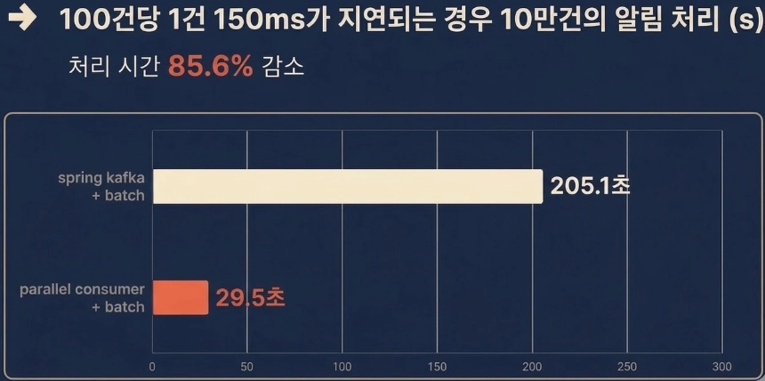

# 프로젝트 소개

**Bloom**은 사용자의 감정과 상담 기록을 구조화된 데이터로 저장하고, 이를 바탕으로 시간의 흐름에 따른 변화 추적과 회고가 가능하도록 지원하는 서비스입니다.

티켓 생성부터 상태 추적, AI 기반 분석, 주기 알림까지 하나의 흐름으로 유기적으로 연결해 사용자 경험의 연속성을 높입니다.

### 핵심 목표

- 사용자 인증 및 권한을 안정적으로 관리한다.
- 감정 및 상황 데이터를 티켓 중심으로 저장하고 추적한다.
- 알림과 이벤트 처리 파이프라인을 통해 사용자 추적 흐름이 끊기지 않도록 유지한다.



### Bloom BE

Bloom BE는 **Gateway**, **Auth**, **Greenroom**, **Notification**의 4개 Spring Boot 서비스와, 이를 지원하는 공통 인프라(**MySQL**, **Redis**, **Kafka**)로 구성되어 있습니다.

각 서비스는 인증, 감정 기록 관리, 분석, 알림 전송 등의 역할을 분리하여 담당하며, 안정적인 데이터 흐름과 확장 가능한 백엔드 구조를 지향합니다.

## 기술 스택

- Java 21
- Spring Boot 4.0.2
- Spring Cloud Gateway
- Spring Data JPA / Redis
- MySQL 8
- Kafka (KRaft, Confluent 이미지)
- Docker / Docker Compose

## 서비스 구성

- `gateway` (`:8080`): API 라우팅, JWT 필터, 통합 Swagger UI
- `auth` (`:8081`): 로그인/회원/관리자/권한/프로필/알림 선호도
- `greenroom` (`:8082`): 티켓, 트래킹, 그래프, AI 연동 API
- `notification` (`:8083`): 알림 이벤트 소비/발송/조회

# ERD



### auth schema

- 사용자 계정/권한/프로필 이미지를 관리한다.
- `profile_image`, `recent_profile_image`, `auth_user_notification_preference`가 사용자 부가정보를 담당한다.

### greenroom schema

- 티켓 생성/추적, AI 결과, 그래프 분석 등 핵심 도메인을 관리한다.
- `tickets`가 중심이고 `tracking`, `mind_frequencies`가 티켓 흐름에 연결된다.
- `user_graph_nodes`, `user_graph_edges`, `graph_analyses`는 사용자별 그래프 데이터 저장용으로 사용된다.

### notification schema

- 발송 대상, 발송 이력, 사용자 알림 설정을 관리한다.
- `greenroom_notification_processed_event`는 이벤트 중복 처리 방지 용도로 사용된다.

---

# 깃 컨벤션

## Branch Strategy

본 프로젝트의 **Git Flow**를 설명합니다. **브랜치 전략과 협업 규칙을 명확히 정의하여 안정적이고 예측 가능한 개발 흐름을 유지**합니다.

```text
main           ← 최종 배포 / 릴리스 브랜치. 태그로 버전 관리.
└── develop    ← 통합 테스트 및 개발 중간 병합 브랜치
    └── feature/*  ← 기능별 단위 작업 브랜치
```

### 브랜치 역할

| 브랜치 | 역할 | 머지 대상 |
| --- | --- | --- |
| `main` | 배포용 브랜치. 항상 안정 상태 유지. 태그로 버전 관리. | `develop` → `main` |
| `develop` | 통합 테스트 및 스테이징 용도. **직접 커밋 금지**, PR만 머지. | `feature/*` → `develop` |
| `feature/*` | 기능 단위 개발 브랜치 (`feature/login`) | `develop` |

---

## Workflow Guidelines

### 커밋 컨벤션

- `(깃이모지) [git이슈번호] {내용}` - 예시: `✨ [#100] 로그인 API 구현`

| 타입 | 이모지 | 설명 |
| --- | --- | --- |
| 초기세팅 | 🎉 `:tada:` | 프로젝트 초기화 |
| 새 기능 | ✨ `:sparkles:` | 새로운 기능 추가 |
| 버그 수정 | 🐛 `:bug:` | 버그 수정 |
| 리팩터링 | ♻️ `:recycle:` | 코드 개선 및 리팩터링 |
| 위치 변경 | 🚚 `:truck:` | 리소스 이동, 이름 변경 |
| 코드 파일 | 🔥 `:fire:` | 코드/파일 삭제 |
| 구성 파일 | 🔧 `:wrench:` | 구성 파일 추가/삭제 |
| 문서 | 📝 `:memo:` | 문서 수정 (README 등) |
| 배포 | 🚀 `:rocket:` | 배포 관련 작업 또는 빌드 설정 |

### Pull Request

- PR 템플릿 사용
- PR 제목 예시: `✨ [KAN-01] 로그인 기능 구현`

1. **기능 개발** 완료 후 `feature/*` 브랜치에서 PR 생성
2. **통합 테스트 완료 후** `develop -> main` PR 생성

---

# Why?

## 모노레포를 사용한 이유

이 프로젝트는 `auth`, `gateway`, `greenroom`, `notification`처럼 서비스 책임을 분리해 MSA 방식으로 설계했지만, 저장소는 하나의 모노레포로 운영하고 있습니다.

이는 "배포 단위는 분리하되, 개발 경험과 협업 비용은 낮추자"는 판단 때문입니다.

모노레포를 선택한 이유는 다음과 같습니다.

- **서비스 간 변경을 한 번에 관리하기 쉽기 때문입니다.**
  MSA 환경에서는 하나의 기능 변경이 여러 서비스의 API, 이벤트, DTO 수정으로 이어지는 경우가 많습니다. 모노레포에서는 이런 연관 변경을 하나의 PR과 하나의 커밋 흐름 안에서 함께 추적할 수 있습니다.
- **초기 개발 단계에서 협업 속도를 높일 수 있기 때문입니다.**
  여러 레포를 따로 관리하면 저장소 설정, 브랜치 전략, 버전 정합성, 공통 규칙 관리에 드는 비용이 커집니다. 현재 단계에서는 서비스 분리의 장점은 가져가되, 운영 복잡도는 과하게 늘리지 않는 것이 더 중요했습니다.
- **공통 인프라와 실행 환경을 통합해서 관리할 수 있기 때문입니다.**
  `docker-compose`, DB 초기화, 로컬 실행 방식, CI 설정 등을 한 저장소에서 관리하면 팀원이 프로젝트를 훨씬 빠르게 이해하고 실행할 수 있습니다.
- **서비스 경계를 코드 레벨에서 명확히 유지할 수 있기 때문입니다.**
  저장소는 하나지만, 각 서비스는 독립된 모듈과 설정, DB를 가지도록 분리했습니다. 즉, 모노레포는 저장 방식의 선택일 뿐이고, 아키텍처적 경계는 그대로 유지하고 있습니다.

## 왜 DB를 각각 두지 않고 스키마만 분리했나요?

이 프로젝트는 서비스별 데이터 경계를 유지해야 했지만, 초기 단계에서부터 DB를 물리적으로 완전히 분리하는 것은 운영 복잡도에 비해 얻는 이점이 크지 않다고 판단했습니다. 그래서 하나의 MySQL 인스턴스를 사용하되, 서비스별로 스키마를 분리하는 방식을 선택했습니다.

이렇게 구성한 이유는 다음과 같습니다.

- **서비스별 데이터 소유권을 충분히 구분할 수 있었기 때문입니다.**
  `auth`, `greenroom`, `notification`처럼 스키마를 나누면 각 서비스가 어떤 테이블을 책임지는지 명확하게 구분할 수 있고, 논리적인 데이터 경계를 유지할 수 있습니다.
- **초기 운영 비용과 관리 복잡도를 줄일 수 있기 때문입니다.**
  DB를 서비스마다 따로 두면 접속 정보, 운영 설정, 백업, 모니터링, 장애 대응 포인트가 모두 늘어납니다. 현재 단계에서는 이런 비용을 줄이고 개발과 운영에 더 집중하는 것이 중요했습니다.
- **로컬 개발 및 테스트 환경을 단순하게 유지할 수 있기 때문입니다.**
  하나의 DB 인스턴스만 띄우면 여러 서비스를 함께 실행하고 검증하기 쉬워집니다. 팀원 입장에서도 실행 환경을 맞추는 부담이 줄어듭니다.
- **현재 트래픽과 규모에서는 물리적 분리까지 필요하지 않았기 때문입니다.**
  서비스 경계를 나누는 목적은 충분히 달성하면서도, 인프라를 과하게 복잡하게 만들지 않는 것이 더 적절한 선택이었습니다.
- **추후 분리 가능성을 열어둘 수 있기 때문입니다.**
  처음부터 완전 분리를 하지 않더라도, 스키마 단위로 경계를 나누어 두면 이후 트래픽 증가나 운영 요구사항에 따라 서비스별 DB 분리로 확장하기가 훨씬 수월합니다.

---

# Trouble Shooting

## 알림 처리 성능 개선

### 문제점

기존 시스템은 하나의 서버가 하나의 Kafka consumer로 동작하고, 각 알림 처리를 개별 저장함으로써 처리 성능이 요구사항에 부족한 문제가 있었습니다. 개선 전 초당 처리량이 362건이었고, 이는 1분에 약 2만 건 정도의 알림 처리를 진행할 수 있는 수준이었습니다.

알림은 사용자가 해결되기 전까지 `+1일`, `+3일`, `+7일`, `+2주` 간격으로 지속적으로 누적되는 구조였기에 현재의 처리량으로는 목표 시간 내 알림을 모두 전달하는 데 부족함이 있었습니다.

### 해결

1. **알림 저장 배치 처리**

   기존에는 개별 이벤트마다 알림을 저장했지만, 이를 배치 처리 방식으로 변경했습니다. 200건의 저장 요청이 모인 뒤 알림 저장을 진행했고, 1초의 idle 시간을 두어 누락 없이 모든 알림을 성공적으로 저장할 수 있도록 구성했습니다.

   이를 통해 초당 `362건 -> 2600건`으로 성능 개선을 이루어냈습니다.

2. **Kafka Parallel Consumer 도입**

   배치 처리 개선 과정을 통해 1분에 약 15만 개의 알림을 저장할 수 있게 되었지만, Greenroom 사용량이 증가한다면 요구되는 처리 성능에 맞춰 Kafka partition을 추가하고 이를 처리해줄 서버를 늘려야 하는 문제가 남아 있었습니다.

   이는 1일 1회 진행되는 요청을 위해 인프라를 과도하게 확장하는 형태가 될 수 있다고 판단했고, 사용자가 증가할 때마다 반복될 수 있는 문제라고 보았습니다.

   따라서 partition을 추가하지 않고도 Kafka event를 병렬적으로 처리할 수 있도록 Parallel Consumer를 도입했습니다.

   그 중에서도 "순차 처리"보다는 "시간 내 도착"이 더욱 중요한 특성을 고려하여 `UNORDERED` 전략을 선택했습니다.

### 결과

최종적으로 초당 `362건 -> 6767건`으로 약 18.7배 상승된 처리량을 달성하였습니다.





## 알림 중복 처리 방지를 위한 이벤트 처리 설계

### 문제점

알림 시스템은 Kafka 이벤트를 기반으로 동작하기 때문에, 재시도나 중복 소비 상황에서 동일한 알림이 여러 번 저장되거나 발송될 가능성이 있었습니다.

특히 장애 상황이나 consumer 재처리 과정에서는 중복 처리 방지 전략이 필수적이었습니다.

### 해결

알림 저장 이력에 `idempotency key`를 두고, 이미 처리된 이벤트를 구분할 수 있는 구조를 적용했습니다.

또한 `processed event`를 별도로 관리하여 동일 이벤트가 다시 들어오더라도 중복 저장 및 중복 발송이 발생하지 않도록 처리했습니다.

### 결과

Kafka 기반 비동기 처리 환경에서도 알림의 중복 저장과 중복 발송 가능성을 줄일 수 있었고, 장애 복구나 재처리 상황에서도 보다 안정적인 알림 시스템을 운영할 수 있었습니다.
